# Lab1 最小可执行内核与启动流程实验报告

> 课程：操作系统实验  
> 实验：Lab1——最小可执行内核和启动流程  
> 姓名：程浩轩  
> 学号：2411102 

---

## 一、实验目的

本实验围绕一个能够在 QEMU 上运行的最小 RISC-V 64 位内核展开，目标不是实现复杂的进程、内存管理或文件系统，而是先建立对“一个内核如何被构建、装入内存并开始执行”的完整认识。通过本实验，我主要完成并理解了以下内容：

1. 使用链接脚本 `kernel.ld` 描述内核的内存布局，确定内核入口和各段的装载地址。
2. 使用 `riscv64-unknown-elf-*` 交叉工具链将 C/汇编源码编译、链接为 RISC-V ELF 内核，并进一步生成裸二进制镜像 `ucore.img`。
3. 使用 QEMU 模拟 64 位 RISC-V 计算机，并借助 OpenSBI 完成底层机器初始化和内核启动。
4. 理解 `kern_entry → kern_init` 的启动过程，以及内核栈是如何建立的。
5. 理解 `cprintf → cons_putc → sbi_console_putchar → ecall` 的输出链路，并通过 GDB 动态验证寄存器传参和 SBI 调用。
6. 通过 `readelf`、`objdump`、`nm` 和 GDB 将源码、链接脚本、最终机器指令和运行时状态对应起来。

---

## 二、实验环境

本实验在 Windows 的 WSL Ubuntu 环境中完成，主要工具版本如下：

- RISC-V GCC：`riscv64-unknown-elf-gcc 10.1.0`
- RISC-V Binutils：`GNU ld 2.35`
- QEMU：`qemu-system-riscv64 6.2.0`
- OpenSBI：`v0.9`
- GDB：`riscv64-unknown-elf-gdb 9.1`
- 目标架构：RISC-V 64 位

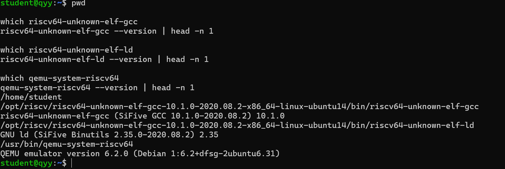

图 1 实验环境及交叉编译工具链检查

---

## 三、实验代码结构与整体逻辑

解压实验代码后，Lab1 的主要目录结构如下：

```text
lab1/
├── Makefile
├── kern/
│   ├── driver/
│   │   └── console.c
│   ├── init/
│   │   ├── entry.S
│   │   └── init.c
│   ├── libs/
│   │   └── stdio.c
│   └── mm/
│       ├── memlayout.h
│       └── mmu.h
├── libs/
│   ├── printfmt.c
│   ├── sbi.c
│   ├── sbi.h
│   ├── string.c
│   └── ...
└── tools/
    ├── kernel.ld
    └── function.mk
```

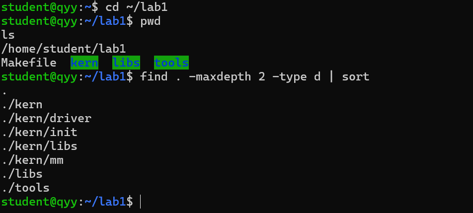

图 2 Lab1 源码目录结构

我对本章整体逻辑线的理解如下：

```text
源码（.c/.S）
    ↓
RISC-V 交叉编译
    ↓
目标文件（.o）
    ↓
ld + tools/kernel.ld
    ↓
bin/kernel（ELF64 RISC-V 内核）
    ↓
objcopy
    ↓
bin/ucore.img（裸二进制镜像）
    ↓
QEMU 启动 OpenSBI
    ↓
OpenSBI 将控制权交给 0x80200000
    ↓
kern_entry
    ↓
建立内核栈
    ↓
kern_init
    ↓
cprintf
    ↓
SBI ecall
    ↓
终端输出 “(THU.CST) os is loading ...”
```

这条链路可以分为四个阶段：**构建阶段、链接与内存布局阶段、启动阶段、SBI 输出阶段**。本实验后续所有文件和函数都围绕这条主线工作。

---

## 四、交叉编译、链接与镜像生成

### 4.1 Makefile 的作用

Makefile 指定了目标平台所需的交叉编译工具：

```makefile
GCCPREFIX := riscv64-unknown-elf-
CC      := $(GCCPREFIX)gcc
LD      := $(GCCPREFIX)ld
OBJCOPY := $(GCCPREFIX)objcopy
OBJDUMP := $(GCCPREFIX)objdump
```

由于实验主机是 x86-64，而最终程序运行在 RISC-V 64 位平台上，因此这里不能直接使用本机 GCC 生成本机程序，而需要使用交叉编译器生成 RISC-V 指令。这就是“交叉编译”的含义。

内核链接的核心规则为：

```makefile
$(kernel): $(KOBJS)
    $(LD) $(LDFLAGS) -T tools/kernel.ld -o $@ $(KOBJS)
```

其中 `-T tools/kernel.ld` 表示使用自定义链接脚本决定内核的入口地址和各段布局。

随后使用：

```makefile
$(OBJCOPY) $(kernel) --strip-all -O binary $@
```

将带有 ELF 头、符号表等信息的 `bin/kernel` 转换为纯二进制镜像 `bin/ucore.img`。

### 4.2 实际编译结果

执行：

```bash
make clean
make
```

成功完成了各源文件的编译、链接以及 `ucore.img` 的生成。

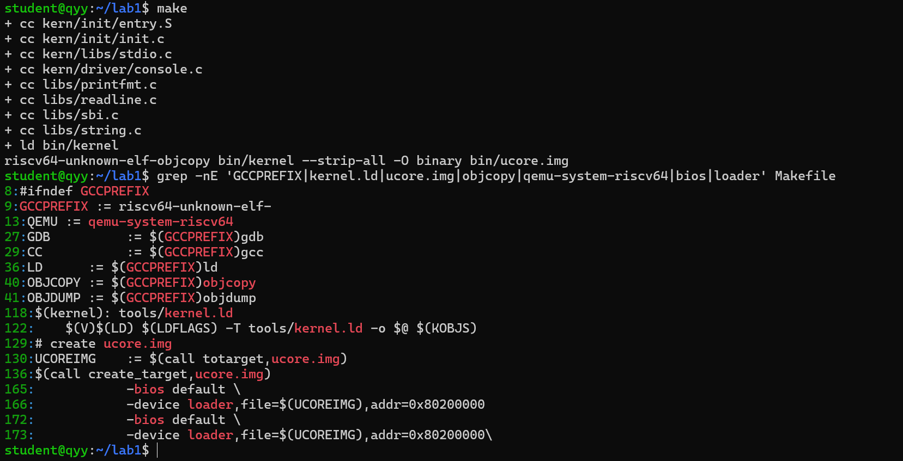

图 3 内核交叉编译、链接和镜像生成

生成文件检查结果：

- `bin/kernel`：ELF 64-bit、RISC-V、静态链接，保留调试信息。
- `bin/ucore.img`：裸二进制数据。

进一步使用 `readelf` 和 `nm` 检查得到：

```text
Class:               ELF64
Machine:             RISC-V
Entry point address: 0x80200000
```

并且：

```text
0000000080200000 T kern_entry
```

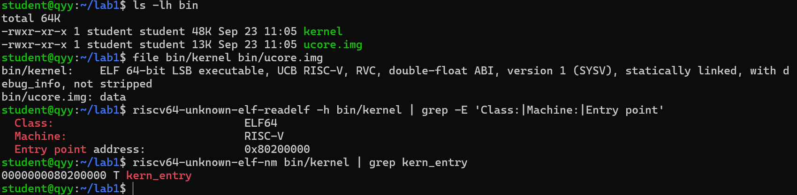

图 4 ELF 类型、目标架构和入口地址验证

这说明链接脚本中规定的入口、最终 ELF 入口和 `kern_entry` 符号地址三者完全一致。

---

## 五、链接脚本与内存布局

### 5.1 `kernel.ld` 核心内容

链接脚本中最关键的两行是：

```ld
OUTPUT_ARCH(riscv)
ENTRY(kern_entry)

BASE_ADDRESS = 0x80200000;
```

含义如下：

- `OUTPUT_ARCH(riscv)`：目标架构为 RISC-V。
- `ENTRY(kern_entry)`：内核入口符号为 `kern_entry`。
- `BASE_ADDRESS = 0x80200000`：内核从物理地址 `0x80200000` 开始布局。

随后脚本依次安排 `.text`、`.rodata`、`.data`、`.sdata`、`.bss`：

```ld
.text   : { ... }
.rodata : { ... }
. = ALIGN(0x1000);
.data   : { ... }
.sdata  : { ... }
.bss    : { ... }
```

其中 `ALIGN(0x1000)` 让数据段按 4 KiB 页边界对齐，这与页大小 `PGSIZE = 4096` 相对应。

### 5.2 实际段地址

使用：

```bash
riscv64-unknown-elf-readelf -S bin/kernel
```

观察到主要段地址：

| 段 | 地址 | 说明 |
|---|---:|---|
| `.text` | `0x80200000` | 内核代码段 |
| `.rodata` | `0x802004c8` | 只读数据 |
| `.data` | `0x80201000` | 已初始化可写数据，包含内核栈空间 |
| `.sdata` | `0x80203000` | 小数据段 |

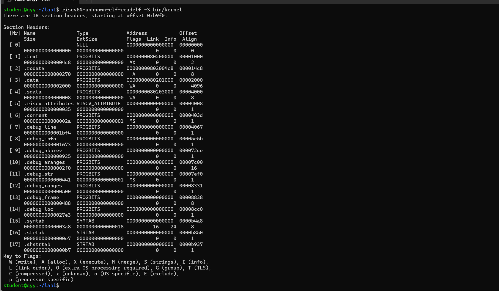

图 5 ELF 段布局

符号表进一步显示：

```text
kern_entry    = 0x80200000
bootstack     = 0x80201000
bootstacktop  = 0x80203000
edata         = 0x80203008
end           = 0x80203008
```

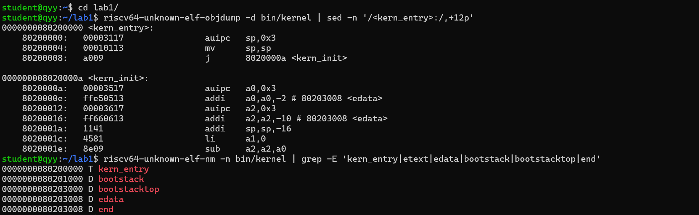

图 6 入口指令和关键符号地址

根据：

```c
#define PGSIZE      4096
#define KSTACKPAGE  2
#define KSTACKSIZE  (KSTACKPAGE * PGSIZE)
```

内核栈大小为 2 × 4096 = 8192 字节，即 8 KiB。`bootstack` 从 `0x80201000` 开始，`bootstacktop` 为 `0x80203000`，二者相差 `0x2000`，与 8 KiB 完全一致。

另外，本次最小内核中 `edata` 与 `end` 相同，说明当前没有额外占用空间的 `.bss` 数据，因此 `memset(edata, 0, end - edata)` 的长度为 0。这并不影响代码逻辑，该代码为后续加入未初始化全局变量预留了标准的 BSS 清零流程。

---

## 六、内核入口与启动流程

### 6.1 `entry.S`

入口文件的核心代码：

```asm
.globl kern_entry
kern_entry:
    la sp, bootstacktop
    tail kern_init
```

它完成两件事：

1. 将栈指针 `sp` 设置为 `bootstacktop`，建立内核自己的运行栈。
2. 使用 `tail kern_init` 跳转到 C 语言入口函数 `kern_init`。

反汇编结果为：

```asm
80200000: auipc sp,0x3
80200004: mv    sp,sp
80200008: j     8020000a <kern_init>
```

这里 `la` 和 `tail` 都属于伪指令，汇编器会将它们展开成实际机器指令。因此源码中的一条伪指令不一定对应最终的一条机器指令。

### 6.2 GDB 动态验证

在 QEMU 中使用 `-s -S` 启动 GDB Server，随后连接 GDB，并在 `kern_entry` 设置断点。

断点刚命中时：

```text
pc = 0x80200000
sp = 0x80017ee0
```

此时内核栈尚未建立。单步执行 `la sp, bootstacktop` 后：

```text
pc = 0x80200004
sp = 0x80203000
```

而符号表中：

```text
bootstacktop = 0x80203000
```

二者完全一致。继续单步后：

```text
pc = 0x8020000a <kern_init>
sp = 0x80203000
```

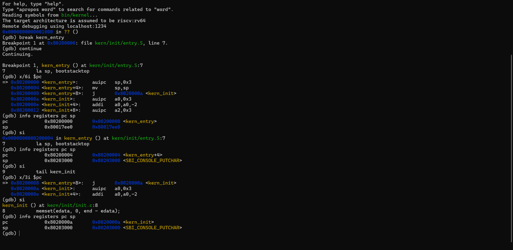

图 7 GDB 单步验证 `kern_entry`、内核栈和 `kern_init`

因此可以确认，真正的启动过程是：

```text
OpenSBI
  ↓
0x80200000 <kern_entry>
  ↓
sp = bootstacktop = 0x80203000
  ↓
kern_init
```

---

## 七、`kern_init` 功能分析

`kern/init/init.c` 中：

```c
int kern_init(void) {
    extern char edata[], end[];
    memset(edata, 0, end - edata);

    const char *message = "(THU.CST) os is loading ...\n";
    cprintf("%s\n\n", message);

    while (1)
        ;
}
```

该函数主要完成三件事：

1. **清空 BSS**：`edata` 和 `end` 由链接脚本提供，`memset` 清零未初始化的静态/全局数据区。
2. **打印启动信息**：调用 `cprintf` 输出内核启动字符串。
3. **保持内核运行**：进入无限循环，避免函数返回到不存在的调用者。

GDB 在 `cprintf` 设置断点后，回溯得到：

```text
#0 cprintf
#1 kern_init
```

并且 `fmt` 参数为：

```text
"%s\n\n"
```

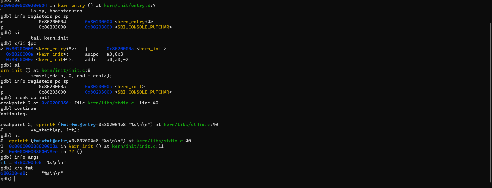

图 8 GDB 验证 `kern_init → cprintf` 调用关系

这证明了源码中观察到的调用关系与运行时完全一致。

---

## 八、OpenSBI 控制台输出链路

### 8.1 核心函数关系

`cprintf` 并不是直接操作 UART 或屏幕，而是经过多层封装逐字符输出：

```text
kern_init
  ↓
cprintf
  ↓
vcprintf
  ↓
vprintfmt
  ↓
cputch
  ↓
cons_putc
  ↓
sbi_console_putchar
  ↓
sbi_call
  ↓
ecall
  ↓
OpenSBI
```

对应代码关系如下。

`kern/libs/stdio.c`：

```c
static void cputch(int c, int *cnt) {
    cons_putc(c);
    (*cnt)++;
}

int vcprintf(const char *fmt, va_list ap) {
    int cnt = 0;
    vprintfmt((void *)cputch, &cnt, fmt, ap);
    return cnt;
}
```

`kern/driver/console.c`：

```c
void cons_putc(int c) {
    sbi_console_putchar((unsigned char)c);
}
```

`libs/sbi.c`：

```c
void sbi_console_putchar(unsigned char ch) {
    sbi_call(SBI_CONSOLE_PUTCHAR, ch, 0, 0);
}
```

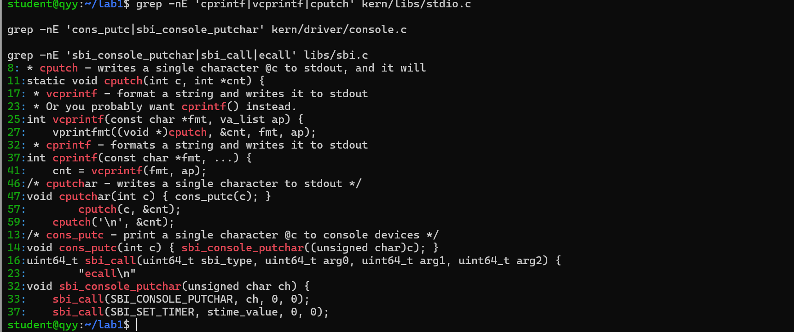

图 9 控制台输出函数调用关系

### 8.2 `sbi_call` 与 `ecall`

`sbi_call` 的核心内联汇编为：

```c
__asm__ volatile (
    "mv x17, %[sbi_type]\n"
    "mv x10, %[arg0]\n"
    "mv x11, %[arg1]\n"
    "mv x12, %[arg2]\n"
    "ecall\n"
    "mv %[ret_val], x10"
    ...
);
```

RISC-V ABI 中：

- `x10` 对应 `a0`
- `x11` 对应 `a1`
- `x12` 对应 `a2`
- `x17` 对应 `a7`

本实验将 SBI 服务号放入 `a7`，参数放入 `a0~a2`，然后通过 `ecall` 请求更高特权级的 OpenSBI 提供服务。

反汇编中可以看到：

```asm
0x80200492: ecall
```

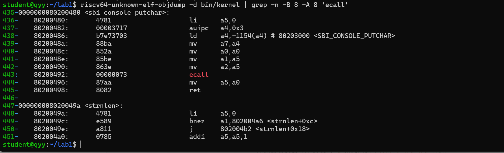

图 10 编译后内核中的 `ecall` 指令

### 8.3 GDB 验证 SBI 参数

在 `cons_putc` 断点处，GDB 显示第一个输出字符：

```text
c = 40
```

ASCII 十进制 40 即字符 `'('`，正是启动字符串：

```text
(THU.CST) os is loading ...
```

的第一个字符。

继续运行到 `sbi_console_putchar`，最后在 `ecall` 前停住，寄存器为：

```text
a0 = 0x28 = 40
a1 = 0
a2 = 0
a7 = 0x1 = 1
```

当前指令：

```asm
=> 0x80200492: ecall
```

其中：

- `a0 = 40`：要输出的字符 `'('`。
- `a7 = 1`：`SBI_CONSOLE_PUTCHAR` 服务号。
- `a1`、`a2` 为 0：该服务不需要额外参数。
- `ecall`：从当前 S-mode 内核向 OpenSBI 请求服务。

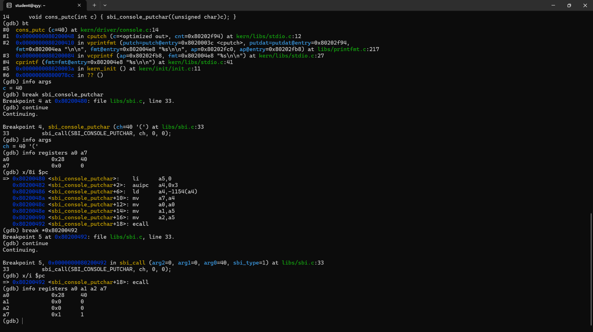

图 11 GDB 验证 SBI 控制台输出服务

因此，Lab1 中一条字符输出的完整路径可以总结为：

```text
cprintf 格式化字符串
    ↓
vprintfmt 按字符处理
    ↓
cons_putc(c)
    ↓
sbi_console_putchar(c)
    ↓
a0 = c, a7 = 1
    ↓
ecall
    ↓
OpenSBI
    ↓
QEMU 串口/终端显示字符
```

---

## 九、QEMU 与 OpenSBI 启动过程

本实验使用 QEMU 的 `virt` 虚拟机平台。OpenSBI 启动后显示：

```text
Firmware Base        : 0x80000000
Domain0 Next Address : 0x80200000
Domain0 Next Mode    : S-mode
```

其中：

- `0x80000000`：OpenSBI 固件所在区域。
- `0x80200000`：实验内核入口地址。
- `S-mode`：OpenSBI 完成机器级初始化后，将控制权交给 Supervisor Mode 的操作系统内核。

最终输出：

```text
(THU.CST) os is loading ...
```

说明内核已经成功从 `kern_entry` 进入 `kern_init`，并成功通过 SBI 输出服务打印字符串。

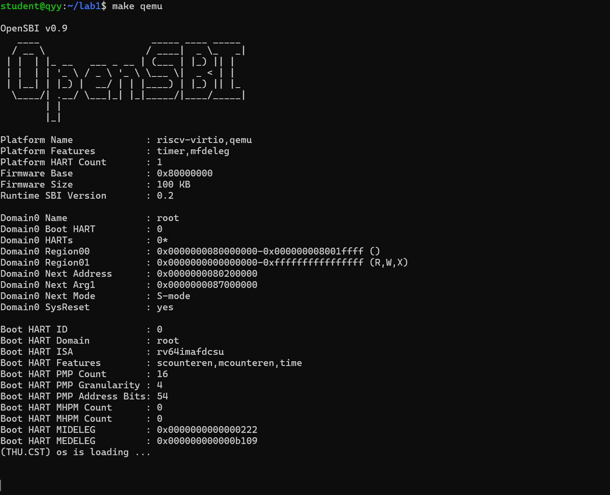

图 12 QEMU + OpenSBI 成功启动 Lab1 内核

### 9.1 本机 QEMU 兼容性问题及解决

实验原始 Makefile 使用：

```makefile
-device loader,file=$(UCOREIMG),addr=0x80200000
```

在本机 `QEMU 6.2.0 + OpenSBI 0.9` 环境中，这种方式虽然将镜像装载到了内存，但 OpenSBI 显示：

```text
Domain0 Next Address : 0x0000000000000000
```

因此没有正确跳转到内核入口，最终也不会打印启动字符串。

经过验证，改为：

```makefile
qemu: $(UCOREIMG)
    $(QEMU) -machine virt -nographic -bios default -kernel $(UCOREIMG)
```

后 OpenSBI 能正确识别：

```text
Domain0 Next Address : 0x80200000
```

并成功进入内核。

GDB 调试目标也采用相同方式，并增加：

```text
-s -S
```

其中：

- `-s`：开启 GDB Server，默认监听 1234 端口。
- `-S`：CPU 启动后立即暂停，等待 GDB 控制。

这一问题说明，启动内核时不仅需要“镜像位于正确地址”，还需要引导环境明确知道“下一步从哪里开始执行”。装载地址和执行入口地址是相关但不同的概念。

---

## 十、各核心函数与模块理解

### 10.1 `tools/kernel.ld`

作用：规定最终内核映像的内存布局和入口地址。

核心理解：链接器不仅是把多个 `.o` 文件“拼起来”，还需要决定代码和数据最终位于什么地址。内核不像普通用户程序那样依赖已有操作系统装载器，因此对布局的控制更加直接。

### 10.2 `kern/init/entry.S`

作用：内核最早执行的汇编入口。

核心理解：C 函数正常运行前必须先准备最基本的运行环境，特别是栈。`entry.S` 将 `sp` 指向 `bootstacktop` 后才进入 `kern_init`。

### 10.3 `kern/init/init.c`

作用：C 语言内核初始化入口。

核心理解：先清零 BSS，再执行更高级的初始化逻辑。本实验只打印启动信息，后续实验可以继续在这里加入中断、内存管理、进程等子系统初始化。

### 10.4 `kern/libs/stdio.c`

作用：提供 `cprintf` 等格式化输出功能。

核心理解：格式化和真正“把字符送到设备”是分离的。`vprintfmt` 负责格式解析，`cputch` 负责将一个字符交给下层控制台接口。

### 10.5 `kern/driver/console.c`

作用：提供统一的控制台接口。

核心理解：上层代码只调用 `cons_putc`，无需知道底层当前是 UART 驱动、SBI 服务还是其他设备。这体现了接口封装和层次化设计。

### 10.6 `libs/sbi.c`

作用：封装 SBI 服务调用。

核心理解：通过寄存器传参和 `ecall` 进入更高特权级，请求 OpenSBI 提供底层服务。本实验中的内核没有直接自行初始化和操作底层串口，而是借用 OpenSBI 的控制台服务。

### 10.7 Makefile

作用：自动完成编译、链接、镜像生成、QEMU 启动和 GDB 调试。

核心理解：构建系统不是实验外围工具，而是内核从源码变成可运行镜像的重要组成部分。编译选项、链接脚本和 QEMU 参数都会直接影响最终是否能启动。

---

## 十一、本实验中的重要知识点及与 OS 原理的对应关系

### 11.1 特权级与 SBI

**实验中的知识点：** OpenSBI 先运行，随后将内核放到 S-mode 执行；内核通过 `ecall` 请求 OpenSBI 服务。

**OS 原理中的对应概念：** 特权级、内核态、受控的特权操作、系统调用/陷入机制。

**联系：** 两者都体现了低权限软件不能任意执行高权限操作，而需要通过规定入口切换到更高权限环境。

**区别：** 普通用户进程执行系统调用通常是 U-mode → S-mode，由操作系统处理；本实验中的 SBI 调用则是 S-mode 内核 → 更高特权级的 SBI 固件。两者层次不同，但“通过陷入请求更高特权服务”的思想相同。

### 11.2 内存布局与链接

**实验中的知识点：** `.text/.rodata/.data/.bss` 的布局、链接地址 `0x80200000`、页对齐。

**OS 原理中的对应概念：** 进程地址空间、代码段/数据段、虚拟内存、页面。

**联系：** 操作系统需要明确不同类型内容在地址空间中的位置、属性和边界。

**区别：** 本实验看到的是内核 ELF 的链接期静态布局，尚未启用页表，也没有完成“虚拟地址 → 物理地址”的动态映射；后续虚拟内存实验才会真正涉及地址翻译与页表。

### 11.3 内核栈

**实验中的知识点：** `bootstack`、`bootstacktop` 和 `sp` 初始化。

**OS 原理中的对应概念：** 函数调用栈、内核栈、上下文保存。

**联系：** 内核同样执行 C 函数，因此必须有栈保存局部变量、返回地址和调用现场。

**区别：** 当前只有启动阶段的一块静态内核栈；在完整操作系统中，不同执行流/进程通常需要独立的内核栈，并涉及调度和上下文切换。

### 11.4 启动加载与操作系统初始化

**实验中的知识点：** QEMU → OpenSBI → `kern_entry` → `kern_init`。

**OS 原理中的对应概念：** Bootloader、内核初始化、硬件抽象层。

**联系：** 操作系统并不是机器上电后的第一段软件，通常需要固件或引导程序完成前期工作并将控制权交给内核。

**区别：** 本实验使用 QEMU 和 OpenSBI 简化了真实机器上的 ROM、固件、设备树和多阶段 Bootloader 流程。

### 11.5 接口分层

**实验中的知识点：** `cprintf → console → SBI` 多层调用。

**OS 原理中的对应概念：** 模块化、设备无关 I/O、驱动层次结构。

**联系：** 上层只依赖抽象接口，从而避免直接依赖具体硬件实现。

**区别：** Lab1 的设备层非常薄，最终借助 OpenSBI 输出；完整操作系统通常会实现自己的 UART/终端驱动、中断处理和缓冲机制。

---

## 十二、OS 原理中重要但本实验尚未涉及的知识点

Lab1 主要解决“内核如何启动”这一最基础问题，因此很多操作系统核心内容尚未出现，包括：

1. **进程与线程**：进程控制块、创建/退出、用户态程序加载等还未实现。
2. **CPU 调度**：没有就绪队列、调度算法和上下文切换。
3. **中断与异常处理**：本实验只主动使用 `ecall`，尚未建立完整 trap/interrupt 框架。
4. **虚拟内存与页表**：尚未建立 Sv39 等页表机制，也没有缺页异常和页面置换。
5. **系统调用**：虽然 SBI 调用在形式上也使用 `ecall`，但它不是用户进程请求内核服务的系统调用机制。
6. **同步与并发**：没有锁、信号量、条件变量，也没有并发执行环境。
7. **文件系统**：没有文件、目录、inode、缓存等抽象。
8. **设备驱动与中断式 I/O**：输出目前依赖 OpenSBI，没有实现完整的串口设备驱动。
9. **多核支持**：实验运行时 `Platform HART Count = 1`，没有涉及 SMP 启动、核间中断和并发内核。
10. **用户态与保护机制**：尚未创建 U-mode 用户进程，也没有完整的地址空间隔离和权限控制。

这些内容与 Lab1 的关系是：Lab1 先搭建一个最小可运行内核，为后续所有操作系统功能提供启动入口、基本运行环境和调试基础。

---

## 十三、练习问题与思考

### 13.1 为什么内核入口是 `0x80200000`？

链接脚本明确指定：

```ld
BASE_ADDRESS = 0x80200000;
ENTRY(kern_entry)
```

最终 `readelf` 和 `nm` 也分别验证了 ELF 入口和 `kern_entry` 均位于 `0x80200000`。QEMU/OpenSBI 启动时也需要把下一执行地址设置为同一位置，因此链接地址、装载地址和执行入口必须彼此匹配。

### 13.2 `bin/kernel` 与 `bin/ucore.img` 有什么区别？

`bin/kernel` 是 ELF 文件，内部包含 ELF 头、段表、符号和调试信息，适合链接分析和 GDB 调试。`ucore.img` 是通过 `objcopy -O binary` 提取出的裸二进制镜像，更适合直接装入指定内存区域执行。

### 13.3 为什么进入 C 语言前要先设置 `sp`？

C 函数调用依赖栈保存返回地址、局部变量和调用现场。如果没有有效栈，进入 `kern_init` 后的函数调用无法可靠工作。因此汇编入口首先建立内核栈，再进入 C 代码。

### 13.4 为什么 `la sp, bootstacktop` 反汇编后不是一条 `la` 指令？

`la` 是 RISC-V 汇编伪指令。汇编器会根据目标地址将其展开为实际指令组合。本实验中反汇编为 `auipc` 等真实机器指令。因此“汇编源码中的指令数”和“最终机器指令数”不一定一一对应。

### 13.5 `edata` 和 `end` 为什么由链接脚本提供？

它们不是普通 C 变量，而是链接器在确定最终布局后才能准确知道的边界符号。C 代码通过 `extern char edata[], end[]` 引用这些符号，从而清零 `.bss` 区域。这体现了 C 代码与链接阶段之间的配合。

### 13.6 OpenSBI 在本实验中起什么作用？

OpenSBI 位于内核之下，负责完成底层 RISC-V 机器相关初始化，并向 S-mode 内核提供标准 SBI 服务。本实验最直观的例子是 `SBI_CONSOLE_PUTCHAR`：内核将服务号和字符参数放入约定寄存器，再执行 `ecall`，由 OpenSBI 完成实际控制台输出。

### 13.7 SBI 调用和操作系统系统调用是否相同？

二者思想相似但对象不同。系统调用通常是用户程序从 U-mode 请求 S-mode 内核服务；SBI 调用则是 S-mode 内核请求更高特权级的 SBI 固件服务。二者都通过受控入口实现权限边界上的服务请求，但处于不同软件层次。

### 13.8 为什么程序打印后一直不退出？

因为 `kern_init` 最后主动执行：

```c
while (1)
    ;
```

内核不像普通用户程序那样可以简单 `return` 给已有操作系统，因此当前最小内核打印完成后进入无限循环是预期行为。

### 13.9 为什么原始 `-device loader` 方式在本机没有成功？

本机环境中该方式把镜像放到了目标内存，但 OpenSBI 的 `Domain0 Next Address` 仍为 0，说明固件没有获得正确的下一执行入口。使用 `-kernel bin/ucore.img` 后，OpenSBI 将 `Next Address` 设置为 `0x80200000`，随后正确跳转到内核。这个问题说明“装载镜像”和“告诉固件从哪里执行”并非完全等价。

---

## 十四、实验总结

通过 Lab1，我第一次把“内核源码如何真正跑起来”这件事从头到尾串联起来。实验开始时，一个 C 文件或汇编文件本身并不是可以直接执行的操作系统内核；它需要先通过 RISC-V 交叉编译器生成目标文件，再由链接器根据 `kernel.ld` 决定代码和数据的最终地址，最后生成 ELF 内核和裸二进制镜像。

运行阶段中，QEMU 提供虚拟 RISC-V 硬件环境，OpenSBI 先完成底层初始化，再将控制权交给 `0x80200000` 的 `kern_entry`。`kern_entry` 建立内核栈后进入 `kern_init`，之后才可以较安全地执行 C 语言函数。启动字符串的输出也不是 `cprintf` 直接操作屏幕，而是经过格式化层、控制台层和 SBI 层，最后通过寄存器传参与 `ecall` 请求 OpenSBI 服务。

本实验中最有帮助的是将静态分析和动态调试结合起来：`readelf` 验证段布局，`nm` 验证符号地址，`objdump` 验证最终机器指令，GDB 则进一步验证运行时 `pc`、`sp`、`a0`、`a7` 等寄存器的真实变化。这样可以把链接脚本、汇编代码、C 代码、机器指令和 CPU 实际执行状态对应起来，而不是只停留在阅读源码层面。

Lab1 本身还没有实现进程、虚拟内存、文件系统和调度等完整操作系统功能，但它建立了这些功能运行所必须的最基本环境，也为后续实验提供了编译、启动和调试基础。

---

---

