# 操作系统实验报告：Lab5 用户进程管理

## 实验基本信息

| 项目 | 内容 |
|---|---|
| 实验名称 | Lab5 用户进程管理 |
| 小组成员 | 2411102 程浩轩、2411112 徐子恩、2410935 胡家华 |
| 提交分支 | `lab5` |
| 源码目录 | `code/` |

### 小组分工

| 成员 | 负责内容 |
|---|---|
| 2411102 程浩轩 | 功能模块一：用户态系统调用；功能模块二：创建并加载第一个用户进程 |
| 2411112 徐子恩 | 功能模块三：复制用户进程；功能模块四：进程退出、让出与终止 |
| 2410935 胡家华 | Challenge：Copy on Write（COW）；系统调用的 GDB 观察 |

## 一、实验目的

Lab5 在已有内存管理、异常处理和虚拟内存机制上，建立用户进程管理的基本闭环。实验通过系统调用连接用户态与内核服务，由内核创建首个用户进程并装载 ELF，再通过 fork、调度、exit、kill 和 wait 管理进程的创建、执行与回收。

本实验关注的不只是各个接口能否被调用，还包括寄存器现场、页表、PCB、进程状态和父子关系如何在不同阶段保持一致。

## 二、实验环境

| 项目 | 环境或说明 |
|---|---|
| 主机环境 | Windows 11、WSL2 Ubuntu-22.04 |
| 目标架构 | RISC-V 64 位，Sv39 |
| 交叉编译工具链 | `riscv64-unknown-elf` 工具链 |
| 编译与运行 | Make、QEMU `virt`、OpenSBI v0.9 |
| 编辑与代码分析 | VS Code、Codex |

以上环境信息根据项目记录整理；本报告只记载已有运行记录，不补写未确认的工具版本或配置参数。

## 三、实验整体逻辑分析

### 3.1 本章节的逻辑主线

Lab5 依赖前序实验提供的基础能力。Lab2 的物理页分配与页引用计数为进程内核栈、页表和用户页面提供资源；Lab3 的 Trap 入口、寄存器保存恢复及调度上下文切换，使内核能够从用户态处理异常并切换进程；Lab4 的 VMA、页表映射及地址空间管理，为 ELF 装载和 fork 地址空间复制提供基础。Lab5 在这些机制之上增加系统调用接口和进程生命周期管理。

整体执行从内核初始化开始。`proc_init` 建立 idleproc 并创建 initproc；initproc 再创建执行用户程序的内核线程。该线程将 ELF 映像交给 `load_icode`，建立用户地址空间、映射程序段和用户栈，并准备 trapframe。随后通过 Trap 返回进入用户态。用户程序发出 `ecall` 后，内核保存现场、识别系统调用号、调用服务函数，并把返回值放回约定寄存器。

用户程序调用 fork 时，内核为子进程建立 PCB、内核栈和 trapframe，并根据标志共享或复制地址空间。父子进程从各自保存的现场继续执行：父进程得到子 PID，子进程得到 0。调度器在 runnable 进程之间切换；yield 请求重新调度，kill 标记目标进程退出。进程退出后释放其地址空间引用并进入僵尸态，父进程通过 wait 取得退出码并最终释放子进程 PCB 和内核栈。父进程退出时，其子进程转交给 initproc，避免遗留悬空父指针。

### 3.2 功能逐步实现与调用顺序

1. **内核启动与进程初始化：**`kern_init → proc_init → kernel_thread(init_main)`。
2. **创建首个用户执行线程：**`init_main → kernel_thread(user_main)`。
3. **装载 ELF 并进入用户态：**`user_main → kernel_execve → do_execve → load_icode → forkrets → sret`。
4. **用户态请求内核服务：**`ecall → SAVE_ALL → exception_handler → syscall → sys_* → RESTORE_ALL → sret`。
5. **复制进程：**`sys_fork → do_fork → copy_mm → dup_mmap → copy_range`，新进程加入进程集合并变为可运行。
6. **调度与生命周期管理：**`do_yield` 设置重新调度标记；`do_kill` 设置退出标记；`do_exit` 释放地址空间并进入僵尸态；`do_wait` 回收子进程。

以上链路把 Lab2 的页面资源管理、Lab3 的 Trap 与调度、Lab4 的虚拟内存管理和 Lab5 的用户进程管理连接起来。具体测试证据与覆盖范围见第五节。

## 四、实验内容与实现

### 4.1 功能模块一：用户态系统调用

**负责人：2411102 程浩轩**

#### 4.1.1 模块功能与设计思路

用户程序不能直接执行内核服务，因此通过 `ecall` 进入内核。Trap 入口先把寄存器和异常状态保存到 trapframe，C 层根据异常原因识别系统调用。分发器使用系统调用号索引服务函数表，从保存现场中读取参数，调用对应内核函数，再把返回值写回 `a0`。Trap 返回路径恢复用户现场并执行 `sret`。

#### 4.1.2 核心函数及职责

| 函数 | 职责 |
|---|---|
| `exception_handler` | 识别 U 态和 S 态 `ecall`，将 `epc` 前移 4 字节后进入系统调用分发。 |
| `syscall` | 从 trapframe 读取系统调用号及 `a1–a5` 参数，检查编号并调用分发表中的函数，把结果写回 `a0`。 |
| `sys_exit`、`sys_fork`、`sys_wait`、`sys_exec` | 分别连接进程退出、复制、等待和执行服务。 |
| `sys_yield`、`sys_kill`、`sys_getpid` | 连接调度请求、进程终止和 PID 查询。 |
| `sys_putc`、`sys_pgdir` | 提供字符输出和页表信息输出服务。 |
| `RESTORE_ALL` | 恢复 trapframe，并依据 `SPP` 设置 `sscratch`，支持回到用户态或内核态。 |

系统调用号定义于 `libs/unistd.h`，用户侧调用约定可见 `user/libs/syscall.c`：`a0` 传系统调用号，`a1–a5` 传参数，返回值从 `a0` 读取。异常处理将 `epc` 加 4 是因为 RISC-V `ecall` 指令为 4 字节；若不前移，返回后会再次执行同一条 `ecall`。

#### 4.1.3 核心实现代码

```c
case 8: /* ECALL from U mode */
    tf->epc += 4;
    syscall();
    break;
```

异常处理从 `cause` 判断 U 态环境调用，推进返回地址后才进入分发。`syscall()` 使用 `current->tf` 作为寄存器现场来源，因此 Trap 保存和当前进程 trapframe 的关联是调用链成立的前提。

```c
uint64_t num = tf->gpr.a0;
uint64_t args[5] = { tf->gpr.a1, tf->gpr.a2, tf->gpr.a3,
                     tf->gpr.a4, tf->gpr.a5 };
int ret = -E_INVAL;
if (num < NUM_SYSCALLS && syscalls[num] != NULL)
    ret = syscalls[num](args);
tf->gpr.a0 = (uintptr_t)ret;
```

分发表将系统调用号映射到 `sys_*` 服务函数；范围和空项检查避免非法编号直接索引或调用无效函数。用户库中的汇编将参数装入寄存器并执行 `ecall`，内核写回的 `a0` 即成为用户侧结果。

`RESTORE_ALL` 从 trapframe 恢复 `sstatus` 和 `sepc`。当 `SPP` 表示返回 U 态时，将内核栈地址写入 `sscratch`，供下一次用户陷入交换栈使用；返回 S 态时清零 `sscratch`。最终由 `sret` 根据恢复的状态与入口地址继续执行。

#### 4.1.4 与其他模块的关系及注意事项

模块一连接用户 API 与内核服务：`sys_fork`、`sys_wait`、`sys_kill` 等服务最终依赖模块三、四的进程管理代码。系统调用传入的用户指针必须经过地址范围和权限校验。当前 `SYS_exec` 虽然注册到分发表，但 `do_execve` 仅支持内核初次启动用户程序；普通用户进程调用会返回 `-E_UNIMP`，不应视为完整支持。

### 4.2 功能模块二：创建并加载第一个用户进程

**负责人：2411102 程浩轩**

#### 4.2.1 模块功能与设计思路

启动时 idleproc 作为空闲进程，`proc_init` 创建 initproc。initproc 运行 `init_main`，再创建执行用户程序的线程；该线程调用 `kernel_execve` 加载内核链接进来的用户 ELF。加载成功后，线程的页表和 trapframe 指向用户程序的地址空间与入口，Trap 返回使处理器进入用户态。用户程序结束后，initproc 通过 `do_wait` 读取退出状态并回收线程。

#### 4.2.2 核心函数及职责

| 函数 | 职责 |
|---|---|
| `alloc_proc` | 分配并初始化 PCB、状态、PID 占位值、页表根字段和链表节点。 |
| `kernel_thread` | 构造内核线程初始 trapframe，并通过 `do_fork` 建立线程。 |
| `init_main` | 创建用户程序执行线程，并等待它退出。 |
| `user_main` | 选择嵌入内核的用户 ELF；当前源码使用 `forktest`。 |
| `kernel_execve` | 调用 `do_execve`，成功后切换 SATP 并以 trapframe 返回。 |
| `do_execve` | 校验初次执行所需参数并调用 ELF 装载函数。 |
| `load_icode` | 检查 ELF、创建地址空间、映射段和用户栈、设置用户入口与状态。 |
| `do_wait` | 等待子进程退出，传递退出码并回收僵尸进程。 |

#### 4.2.3 核心实现代码

```c
static int user_main(void *arg) {
    (void)arg;
    int ret = KERNEL_EXECVE(forktest);
    panic("kernel_execve failed: %d", ret);
}
```

`user_main` 是内核线程执行入口之一。执行成功时 `kernel_execve` 不按普通函数返回，而是恢复新构造的 trapframe 进入用户态；因此后面的 panic 仅用于处理装载失败返回的情况。当前实际源码启动的是 `forktest`，与旧报告记载的 `hello` 不同。

```c
current->mm = mm;
mm_count_inc(mm);
current->pgdir = PADDR(mm->pgdir);
memset(current->tf, 0, sizeof(struct trapframe));
current->tf->gpr.sp = USTACKTOP;
current->tf->epc = elf->e_entry;
current->tf->status = (read_csr(sstatus) | SSTATUS_SPIE) &
                      ~(SSTATUS_SPP | SSTATUS_SIE);
```

装载完成后，当前进程关联新 mm 和页表物理地址。trapframe 的 `sp` 指向用户栈顶，`epc` 指向 ELF 入口；清除 `SPP` 使异常返回目标为 U 态，并通过 `SPIE` 设置返回后的中断状态。`kernel_execve` 随后切换 SATP 并调用 `forkrets`，由汇编返回路径恢复现场。

`load_icode` 对 ELF 程序头进行边界检查，为 `PT_LOAD` 段建立 VMA、分配页面、清零页面并复制文件内容；随后建立用户栈 VMA，当前源码为栈顶分配四个物理页。加载失败时统一解除映射并释放页目录和 mm。段的 VMA 标志来源于 ELF，但当前页面分配权限使用统一的 `PTE_U | PTE_R | PTE_W | PTE_X`，因此页级权限没有严格保持 ELF 段权限。

#### 4.2.4 与其他模块的关系及注意事项

该模块依赖 Lab2 的物理页分配、Lab3 的 Trap 返回及上下文切换、Lab4 的 VMA 和页表管理。`kernel_thread` 建立执行载体，`load_icode` 将载体准备为用户进程；`init_main` 是父进程，等待用户线程退出。普通用户态 `exec` 的地址空间替换目前未实现，这与内核首次加载 ELF 是不同路径。

### 4.3 功能模块三：复制用户进程

**负责人：2411112 徐子恩**

#### 4.3.1 模块功能与设计思路

fork 需要复制进程的执行现场及用户地址空间，同时区分“共享 mm”与“独立复制 mm”。实现按层分工：`do_fork` 管理 PCB、内核栈、PID 和进程关系；`copy_mm` 决定共享或复制；`dup_mmap` 复制 VMA 并逐段调用 `copy_range`；`copy_range` 操作页表和物理页面。这样地址空间策略与底层页面复制相互分离，失败时由上层统一回滚。

#### 4.3.2 核心函数及职责

| 函数 | 所属层 | 职责 |
|---|---|---|
| `do_fork` | 进程管理 | 建立子 PCB、内核栈、父子关系、PID、进程/哈希链表和可运行状态。 |
| `copy_mm` | 地址空间策略 | 无 mm 时保持内核页表；`CLONE_VM` 时共享 mm 并增加引用计数；否则创建新 mm 并复制映射。 |
| `dup_mmap` | VMA 管理 | 按父 mm 中的 VMA 范围与标志在子 mm 中创建 VMA，再复制该范围内的用户页。 |
| `copy_range` | 页表/物理页 | 对普通 fork 分配新物理页、复制内容并按原权限映射；共享模式复用页面并增加引用计数。 |

#### 4.3.3 核心实现代码

```c
static int copy_mm(uint32_t clone_flags, struct proc_struct *proc) {
    struct mm_struct *oldmm = current->mm;
    if (oldmm == NULL) {
        proc->mm = NULL;
        proc->pgdir = boot_pgdir_pa;
        return 0;
    }
    if (clone_flags & CLONE_VM) {
        mm_count_inc(oldmm);
        proc->mm = oldmm;
        proc->pgdir = current->pgdir;
        return 0;
    }
    ...
}
```

内核线程可以没有独立用户 mm，此时子线程继续使用启动页表。`CLONE_VM` 表示共享地址空间，只递增 mm 引用计数，不复制 VMA 和页面；普通用户 fork 则创建新的 mm 和页目录，成功完成 `dup_mmap` 后才把它交给子进程并增加该 mm 的拥有者计数。

```c
if ((ret = setup_kstack(proc)) != 0) { kfree(proc); return ret; }
if ((ret = copy_mm(clone_flags, proc)) != 0) {
    put_kstack(proc);
    kfree(proc);
    return ret;
}
proc->parent = current;
copy_thread(proc, stack, tf);
proc->pid = get_pid();
```

资源按建立顺序申请，失败时释放已成功申请的资源。`copy_thread` 将父 trapframe 复制到子内核栈上的 trapframe，并把子 `a0` 设为 0；父侧系统调用处理器把 `do_fork` 返回的 PID 写入父 trapframe 的 `a0`，因此形成父进程得到 PID、子进程得到 0 的语义。

```c
mm_map(to, vma->vm_start, vma->vm_end - vma->vm_start,
       vma->vm_flags, NULL);
copy_range(to->pgdir, from->pgdir, vma->vm_start, vma->vm_end, 0);
```

`dup_mmap` 对父 mm 的每个 VMA 创建同范围、同标志的子 VMA，并复制其中已经存在的用户页。未映射页面跳过，不会凭空为父子进程分配页面。

```c
struct Page *dst_page = alloc_page();
if (dst_page == NULL) return -E_NO_MEM;
memcpy(page2kva(dst_page), page2kva(src_page), PGSIZE);
page_insert(to, dst_page, la, perm);
```

普通 fork 为映射页面分配独立物理页，整页复制内容，并从父页表项保留读、写、执行、用户等权限。`page_insert` 建立子页表映射并增加页面引用计数。若后续复制失败，`copy_mm` 将新 mm 的计数设为零，解除已经建立的映射、释放页目录和 VMA，再由 `do_fork` 释放内核栈与 PCB。

子进程完成链表登记后调用 `wakeup_proc` 进入 runnable 状态；调度器之后可选择该进程。其初始上下文返回到 `forkret`，再通过 trapframe 恢复开始执行。

#### 4.3.4 与其他模块的关系及注意事项

模块三使用 Lab2 的页分配与引用计数、Lab4 的 VMA 和页表操作，并依赖 Lab3 的上下文切换和 TrapFrame 格式。`CLONE_VM` 共享 mm 的计数在进程退出时递减，只有最后一个使用者退出才释放地址空间。普通 fork 的页面共享和延迟复制由第 4.5 节的 COW 完成，`copy_range(..., 0)` 不再在 fork 时整页 `memcpy`。

### 4.4 功能模块四：进程退出、让出与终止

**负责人：2411112 徐子恩**

#### 4.4.1 模块功能与设计思路

进程生命周期中，退出、等待和回收分为不同阶段。`do_exit` 释放进程不再使用的地址空间并将 PCB 留在进程表中作为僵尸；父进程通过 `do_wait` 读取退出码后再删除 PID 索引、进程关系、内核栈和 PCB。PCB 延后释放，是因为父进程仍需读取退出状态并定位该子进程。

`do_yield` 只提出重新调度请求，由调度路径决定切换时机。`do_kill` 不直接释放目标进程，而是设置 `PF_EXITING`；目标若在等待则先唤醒，在返回用户态的 Trap 路径检查退出标记后进入退出处理。idleproc 和 initproc 受保护，避免系统失去空闲调度实体或孤儿进程的收养者。

#### 4.4.2 核心函数及职责

| 函数 | 职责 |
|---|---|
| `do_exit` | 拒绝 idleproc/initproc 退出；转移子进程；释放最后一个共享 mm；记录退出码、设为僵尸并唤醒父进程。 |
| `do_wait` | 查找当前进程的子进程；没有僵尸时睡眠等待；找到僵尸后传递退出码并回收 PCB 与内核栈。 |
| `do_yield` | 设置 `need_resched`，让返回路径或调度循环重新选择进程。 |
| `do_kill` | 查找目标、拒绝无效/受保护/已僵尸目标、设置 `PF_EXITING`，并在目标睡眠时唤醒。 |
| `wakeup_proc` | 将睡眠进程改为 runnable 并清除等待状态。 |
| `schedule` | 选择 runnable 进程并调用 `proc_run` 切换执行上下文。 |

#### 4.4.3 核心实现代码

```c
while (current->cptr != NULL) {
    struct proc_struct *child = current->cptr;
    current->cptr = child->optr;
    if (current->cptr != NULL) current->cptr->yptr = NULL;
    child->parent = initproc;
    child->optr = initproc->cptr;
    child->yptr = NULL;
    if (initproc->cptr != NULL) initproc->cptr->yptr = child;
    initproc->cptr = child;
    if (child->state == PROC_ZOMBIE && initproc->state == PROC_SLEEPING)
        wakeup_proc(initproc);
}
```

父进程退出前逐个摘下自己的子进程，并将其挂到 initproc 的孩子链表头部，同时更新 `parent`、`optr`、`yptr`。已是僵尸的子进程若遇到正在等待的 initproc，会触发唤醒。这个修改避免父进程 PCB 被 wait 回收后，子进程仍指向已释放 PCB，并使转交来的僵尸仍可被 initproc 等待回收。

```c
if (current->mm != NULL) {
    struct mm_struct *mm = current->mm;
    current->mm = NULL;
    if (mm_count_dec(mm) == 0) {
        exit_mmap(mm);
        put_pgdir(mm);
        mm_destroy(mm);
    }
    current->pgdir = boot_pgdir_pa;
    write_csr(satp, (1UL << 63) | (boot_pgdir_pa >> PGSHIFT));
    asm volatile("sfence.vma" ::: "memory");
}
current->state = PROC_ZOMBIE;
current->exit_code = error_code;
if (current->parent != NULL && current->parent->state == PROC_SLEEPING)
    wakeup_proc(current->parent);
schedule();
```

退出进程先解除自身对 mm 的引用。若引用计数归零，再释放 VMA 映射、页目录和 mm；若仍有 `CLONE_VM` 使用者，地址空间继续保留。随后切回内核页表，记录僵尸状态和退出码，并唤醒等待中的父进程。进程此时保留 PCB 和内核栈，等待 `do_wait` 最终回收。

```c
int do_yield(void) {
    if (current == NULL) return -E_INVAL;
    current->need_resched = 1;
    return 0;
}
```

yield 不在服务函数内手动切换栈，而是设置当前进程的调度标记，由陷阱返回路径或 idle 调度循环调用调度器，避免把策略和底层切换混在系统调用服务中。

```c
local_intr_save(intr_flag);
struct proc_struct *p = find_proc(pid);
if (p == NULL || p == idleproc || p == initproc || p->state == PROC_ZOMBIE) {
    local_intr_restore(intr_flag);
    return -E_INVAL;
}
p->flags |= PF_EXITING;
if (p->state == PROC_SLEEPING) wakeup_proc(p);
local_intr_restore(intr_flag);
```

`do_kill` 在短临界区中查找并标记目标，使进程集合状态检查与标记不会被本地中断切换打断；对睡眠目标调用 `wakeup_proc`，让其有机会被调度并处理退出标志。该机制是标记退出请求，不代表调用 kill 的进程立即释放目标资源。

`do_wait` 在子进程仍运行时将父进程设为 `PROC_SLEEPING`、记录 `WT_CHILD` 并调度；子进程退出时唤醒父进程。发现僵尸后，wait 先写回退出码，再在关中断临界区摘除 PID 哈希和父子关系，最后释放内核栈与 PCB。这样退出状态可被读取，进程链表和哈希表也在回收时同步更新。

#### 4.4.4 与其他模块的关系及注意事项

模块四连接模块一的 `SYS_exit`、`SYS_wait`、`SYS_yield`、`SYS_kill` 和模块三创建的子进程。进程退出会影响共享 mm 引用计数；父进程等待依赖正确的父子链表；kill 标记需由陷阱返回路径和调度流程实际处理。父子关系变更和 PID/链表登记、摘除均在本地关中断区域内完成；这不是多核锁保护，当前实现针对单核调度路径。

### 4.5 扩展练习 1：实现 Copy on Write（COW）机制

**负责人：2410935 胡家华**

**题目：**这个扩展练习涉及到本实验和上一个实验“虚拟内存管理”。在 ucore 操作系统中，当一个用户父进程创建自己的子进程时，父进程会把其申请的用户空间设置为只读，子进程可共享父进程占用的用户内存空间中的页面，这就是一个共享的资源。当其中任何一个进程修改此用户内存空间中的某页面时，ucore 会通过 page fault 异常获知该操作，并完成拷贝内存页面，使得两个进程都有各自的内存页面。这样一个进程所做的修改不会被另外一个进程可见了。请在 ucore 中实现这样的 COW 机制。

由于 COW 实现比较复杂，容易引入 bug，请参考 https://dirtycow.ninja/ 看看能否在 ucore 的 COW 实现中模拟这个错误和解决方案。需要有解释。

请提供实现代码、测试用例和设计报告（包括在 COW 情况下的各种状态转换，类似有限状态自动机的说明）。

#### 4.5.1 机制

普通 fork 不再为每个已映射用户页分配新物理页。`copy_range` 在 `share == 0` 时按页表项权限处理：

- 页表项带有 `PTE_W`，或者已经带有软件位 `PTE_COW`：父、子两边都去掉写权限并置 `PTE_COW`，继续共享同一物理页。父页表是当前正在使用的页表，修改后对该地址执行 `sfence.vma`。
- 页表项只读且没有 `PTE_COW`：按原权限共享，写入时不把它当成可修复的写时复制页。
- `share == 1` 仍表示 `CLONE_VM` 那种共享，权限保持不变。

`PTE_COW` 使用 RISC-V 页表项的 RSW 位，值是 `0x100`。硬件忽略这一位；没有 `PTE_R/W/X` 的项才会被当成下一级页表，COW 页仍然保留 `PTE_R` 和 `PTE_U`，所以读和取指可以继续进行，只有存储会产生页错误。

存储页错误的 `scause` 是 15，故障地址在 `stval`。`exception_handler` 把 12、13、15 交给 `do_pgfault`。处理期间持有该 `mm` 的锁。引用计数大于 1 时，先把旧页复制到新物理页，再调用 `page_insert` 装上可写且不带 `PTE_COW` 的新映射；引用计数已经是 1 时，说明没有其他页表项还指向它，直接恢复 `PTE_W` 并清掉 `PTE_COW`。

#### 4.5.2 状态

一张用户页从本次加载到退出，和写时复制有关的状态可以看成：

| 状态 | 页表项 | 引用计数 | 下一次写入 |
|---|---|---|---|
| 私有可写 | `PTE_W`，无 `PTE_COW` | 1 | 直接写，不陷入 |
| 共享 COW | 无 `PTE_W`，有 `PTE_COW` | 大于 1 | 复制出私有页，旧页仍只读 |
| 最后持有者 | 无 `PTE_W`，有 `PTE_COW` | 1 | 就地恢复可写 |
| 只读共享 | 无 `PTE_W`，无 `PTE_COW` | 任意 | 不修复，进程按页错误退出 |

状态迁移是：

1. `load_icode` 建立私有可写页。
2. fork 把私有可写页或已有 COW 页变成双方的共享 COW 页，引用计数加一。
3. 任一进程写入且引用计数大于 1：该进程进入私有可写，另一进程留在共享 COW，旧页引用计数减一。
4. 写入时引用计数已经是 1：共享 COW 就地变回私有可写。
5. `exit_mmap` 解除映射。引用计数降到 0 时释放物理页。

#### 4.5.3 Dirty COW

CVE-2016-5195 的窗口是：内核在处理对只读映射的写入时，先把原来的页看成可写，或在复制完成前让别的写入路径碰到这张共享页；同时 `madvise(MADV_DONTNEED)` 可以在检查和使用之间拆掉页表项，使后续写入落到不该修改的页上。本实验没有 `/proc/self/mem`、`ptrace` 和 `madvise`，不能把那个竞争原样跑起来。

同类错误如果写进 ucore，就是缺页处理先给共享页表项加上 `PTE_W`，然后再复制。复制完成之前，另一份映射已经能写这张物理页。当前实现排除这个顺序：共享页表项始终不带 `PTE_W`；新数据只写进刚分配的页的内核虚拟地址；`page_insert` 最后一次存储才替换页表项。引用计数检查、复制和替换都在 `mm` 锁内完成，避免另一次缺页把“仍然被共享”误判成“只剩一个持有者”。

#### 4.5.4 测试

**cowtest。** 将 `user_main` 中的 `KERNEL_EXECVE(forktest)` 临时改为 `KERNEL_EXECVE(cowtest)`，在 WSL 的 `code/` 目录执行 `make` 后运行：

```bash
qemu-system-riscv64 -machine virt -nographic -bios default -kernel bin/ucore.img
```

`code/user/cowtest.c` 的静态数组初值是 `parent-data`。子进程只把首字节改成 `C`，父进程等待子进程结束后再读同一数组。测完已把默认用户程序改回 `forktest`。

```text
kernel_execve: pid = 2, name = "cowtest".
child sees Carent-data
parent sees parent-data
parent writes Parent-data
cowtest pass.
user process pid=2 exited: wait=0 code=0
```

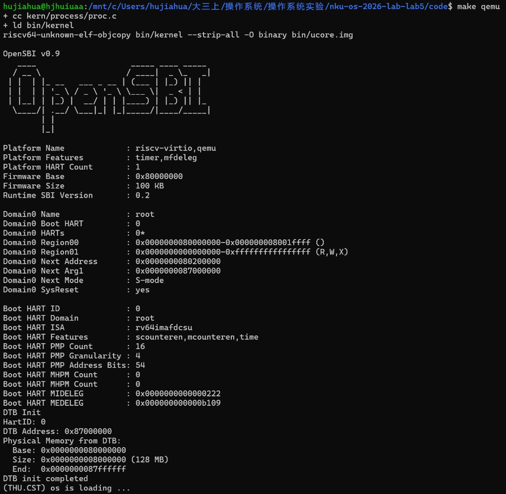

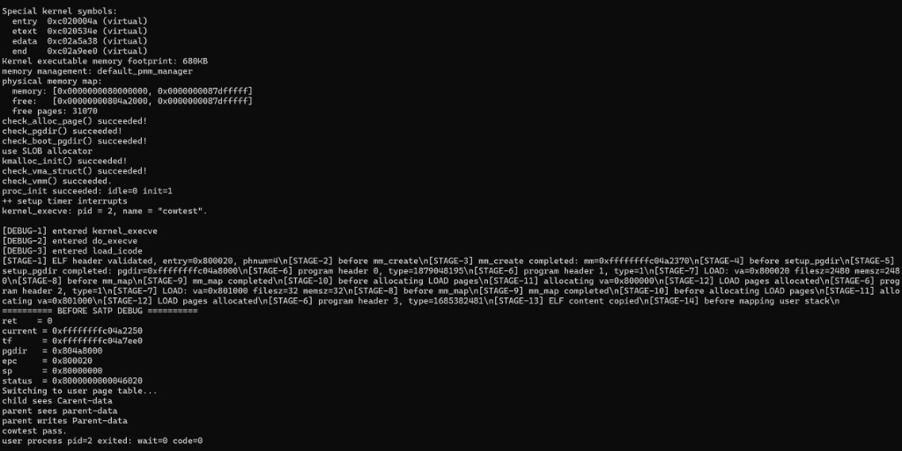

子进程看到的 `Carent-data` 只是首字节被替换。父进程在等待期间仍看到 `parent-data`，说明写入触发的是私有副本，不是共享页上的直接修改。父进程随后把自己的首字节改成 `P`，打印 `parent writes Parent-data`，说明只剩一个引用时也能重新获得写权限。`cowtest pass.` 和 `wait=0 code=0` 是本次运行成功的标志。

**启用 COW 后的 forktest。** 默认用户程序改回 `forktest` 后重新链接并运行。`cprintf` 会写用户栈，因此这条路径同样经过 COW 缺页。

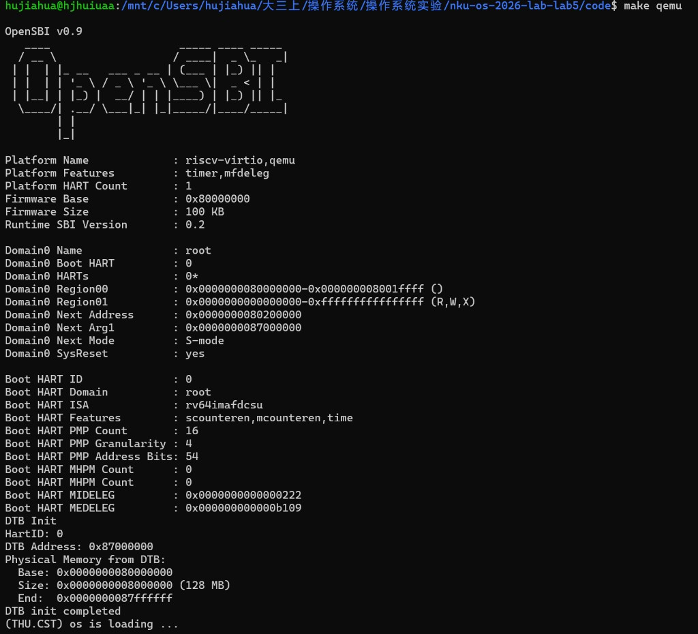

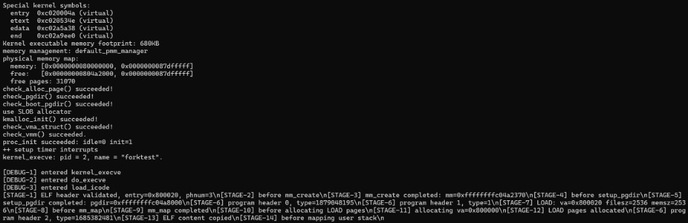

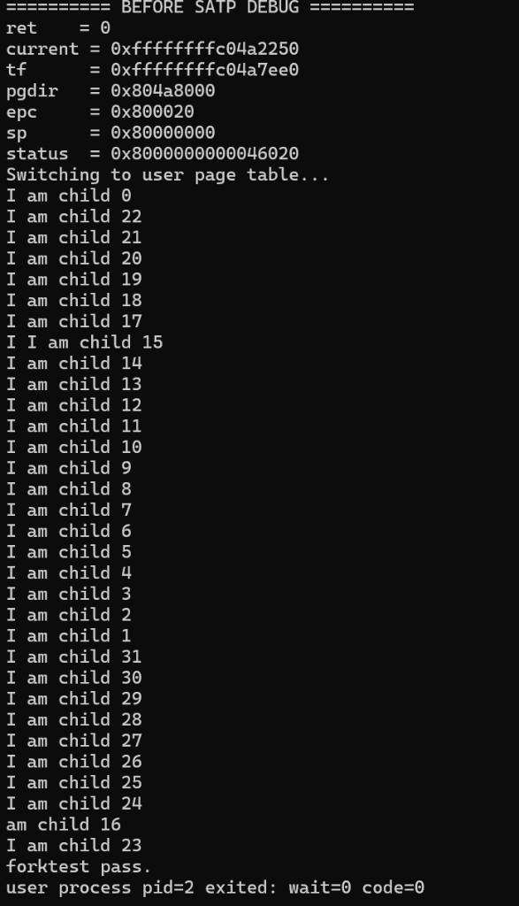

多条 `I am child ...` 是多个子进程执行时的预期输出。串口上相邻输出有时会连在同一行，例如 `I I am child 15`，这是多个子进程同时打印造成的。`forktest pass.` 以及末尾 `user process pid=2 exited: wait=0 code=0` 表明延迟复制没有破坏原有 fork 主流程。

### 4.6 扩展练习 2：用户程序的预先加载

**题目：**说明该用户程序是何时被预先加载到内存中的？与我们常用操作系统的加载有何区别，原因是什么？

用户 ELF 在编译链接时就放进内核镜像。`Makefile` 先把 `code/user/*.c` 链接成 `obj/__user_*.out`，再在链接内核时用 `--format=binary` 把这些文件并进 `bin/kernel`。`KERNEL_EXECVE(forktest)` 因此能引用 `_binary_obj___user_forktest_out_start` 和对应的 size。QEMU 加载内核镜像时，这些字节作为内核数据的一部分进入物理内存，但它们还不是进程。

直到 `user_main` 调用 `kernel_execve`，`load_icode` 才解析 ELF，创建用户页表，并把段内容复制到用户地址。常用操作系统的 `exec` 则是在系统调用发生时从文件系统读取可执行文件，可以按页从文件后备存储调入，也可以替换已有进程映像。本实验没有存放程序的磁盘文件系统，所以只能把需要运行的程序预先链进内核；代价是换一个用户程序要重新链接内核，而不是在运行时打开一个新的文件。

## 五、测试与验证

以下测试结果依据已有实验记录整理。记录显示 `make` 成功生成 `bin/kernel` 和 `bin/ucore.img`；编译期间 `testbss.c` 有数组越界 warning，但未阻止链接。没有执行过的自动评分、性能测试及异常边界场景不列为通过。

### 5.1 Hello 用户程序测试

**测试目的：**检查用户程序装载、进入用户态、正常退出及父进程等待链路。

**测试方法：**构建并运行 Hello 用户程序，观察控制台输出和父进程 wait 结果。

**测试截图：**


**结果分析：**记录输出包含 `Hello world!!`、`hello pass.`，并显示 `wait=0 code=0`。这说明该次运行中的用户程序成功执行、正常退出，父进程 wait 返回成功并取得退出码 0。

### 5.2 Yield 系统调用测试

**测试目的：**检查用户程序发出 yield 请求后能够继续执行，并最终正常退出。

**测试方法：**构建并运行 Yield 用户程序，观察多轮迭代输出、通过标志和退出等待结果。

**测试截图：**


**结果分析：**记录中出现多次迭代输出、`yield pass.` 和 `wait=0 code=0`。该结果支持本次运行中 yield 调用可返回、程序继续执行并由父进程正常回收；不代表已验证所有调度时序。

### 5.3 Forktest 集成测试

**测试目的：**在集成版本中检查 fork 创建多个子进程，以及父子进程调度、退出和等待回收主流程。

**测试方法：**在模块三、四修改后的代码上运行 `make` 和 `make qemu`，使用 `forktest` 用户程序，观察子进程输出和最终结果。已有记录输出包括 `kernel_execve: pid = 2, name = "forktest".`、多个 `I am child ...`、`forktest pass.` 和 `user process pid=2 exited: wait=0 code=0`。

**测试截图：**

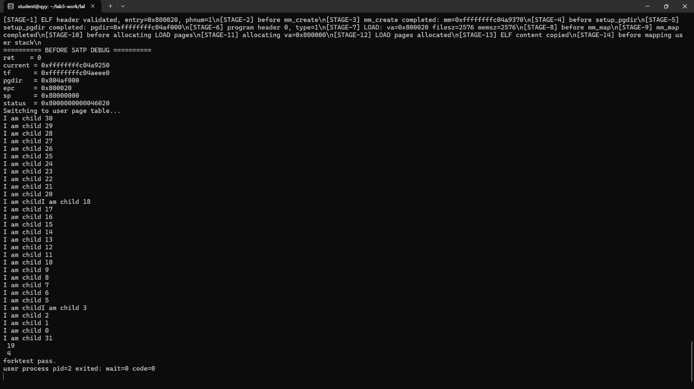

**结果分析：**多条 `I am child ...` 是多个子进程执行时的预期输出，不是测试失败。`forktest pass.` 是测试成功标志；末尾 wait 返回 0、退出码为 0，表明本次运行的主创建、执行、退出和回收流程正常。启用 COW 之后的再次运行见 4.5.4。该项属于小组集成测试，不能据此声称所有 fork 错误回滚或边界情况均已覆盖。

### 5.4 Waitkill 进程终止测试

**测试目的：**观察 waitkill 用户程序创建进程、发出 kill 请求以及父进程等待终止进程的主路径。

**测试方法：**运行 `waitkill` 用户程序。已有控制台记录如下：

```text
kernel_execve: pid = 2, name = "waitkill".
Switching to user page table...
wait child 1.
child 1.
child 2.
kill parent ok.
kill child1 ok.
user process pid=2 exited: wait=0 code=-9
```

**测试截图：**


**结果分析：**输出表明程序成功启动并执行到等待及 kill 相关逻辑；`kill parent ok.` 和 `kill child1 ok.` 表明程序中的对应 kill 调用返回成功。`wait=0` 表示父进程成功等待并回收目标进程；退出码 `-9` 表示该进程以被终止状态退出，不应简单视为测试失败。该次运行没有覆盖所有孤儿进程场景或 kill 边界条件，不能据此扩大测试结论。

### 5.5 测试结果汇总

| 测试项目 | 记录结果 | 结论范围 |
|---|---|---|
| Hello | `hello pass.`；`wait=0 code=0` | 本次用户程序执行和退出等待链路正常 |
| Yield | 多轮输出；`yield pass.`；退出码 0 | 本次 yield 调用后程序继续执行并退出 |
| Forktest | 多个子进程输出；`forktest pass.`；退出码 0 | 集成版本的 fork 与退出等待主流程正常 |
| Waitkill | 两条 kill 成功提示；`wait=0 code=-9` | 本次 kill/wait 路径执行到预期结果 |
| COW | `cowtest pass.`；`wait=0 code=0` | 本次 fork 后的写入只影响写入者 |
| Forktest（启用 COW 后） | 多个 `I am child`；`forktest pass.`；`wait=0 code=0` | 延迟复制没有破坏原有 fork 主流程 |

### 5.6 COW 测试

`cowtest` 和启用 COW 后的 `forktest` 写在扩展练习 1 的 4.5.4。两次运行均以 `pass.` 结束，父进程等待结果为 `wait=0 code=0`。

## 六、实验总结与收获

### 6.1 对操作系统的理解

Lab5 展示了用户态和内核态之间的边界如何由 Trap 与系统调用连接。用户程序通过 `ecall` 请求内核服务；TrapFrame 保存其寄存器状态，使内核在处理后能够恢复原执行现场。系统调用分发不只是函数跳转，还依赖寄存器约定、异常返回地址和特权级状态一致。

进程管理也不只是分配一个 PCB。PCB、内核栈、trapframe、页表和 mm 共同描述一个可调度的执行实体。fork 复制现场并为普通进程建立独立地址空间；共享地址空间则通过引用计数延长 mm 生命周期。进程状态决定调度器是否可选中它，而父子关系决定退出状态由谁读取和回收。

退出与回收被拆成两个阶段：进程先释放不再使用的地址空间并成为僵尸，父进程 wait 取得状态后再释放 PCB 和内核栈。父进程退出时需要转移子进程关系，否则子进程会保留悬空父指针，也可能使僵尸无人回收。由此可见，进程状态、页引用计数和关系链表必须协同维护。

### 6.2 AI 协作开发的经验

本次使用 Codex 阅读 Lab5 源码并进行静态检查，再围绕本人负责的模块三、四检查已有实现，尽量保留原有正确逻辑，只补充缺失功能和确定的问题。修改重点是退出时转交子进程、保持父子链表关系一致，以及在进程管理状态更新处使用已有的本地临界区保护。随后根据已有的 make、QEMU 和用户程序运行记录整理测试结果；未实际执行或未覆盖的测试没有写成通过。

### 6.3 Copy on Write 与调试

COW 把 fork 的复制从“创建时整页拷贝”改成“写入时才拷贝”。页表项上的软件位记录共享关系，存储页错误负责把共享页分裂成私有页。引用计数决定能否就地恢复写权限。

调试系统调用时，内核 GDB 和 QEMU 进程的 GDB 看的不是同一层。前者停在客户机的 `ecall` 和 `sret`，后者要看模拟器怎样翻译这两条指令。用户程序符号不会随 `make gdb` 自动出现，因为用户 ELF 只是链进内核的二进制数据，不是内核的 DWARF 信息。

## 七、GDB：系统调用进入与返回

**负责人：2410935 胡家华**

这一节对应指导书“分支任务：gdb 调试系统调用以及返回”。命令都在 WSL 的 `code/` 目录执行，工具链路径为 `/home/hujiahua/toolchains/riscv-elf-toolchains/bin`。

### 7.1 两个 GDB 分别看什么

第一个终端执行 `make debug`。它启动 `qemu-system-riscv64 -s -S`，QEMU 在 1234 端口等 GDB，客户机先不跑。

第二个终端执行 `make gdb`。`Makefile` 里的命令是：

```text
riscv64-unknown-elf-gdb -ex 'file bin/kernel' -ex 'set arch riscv:rv64' -ex 'target remote localhost:1234'
```

这个 GDB 使用的是 RISC-V 交叉调试器，加载的是 `bin/kernel`。它看到的是客户机里的 ucore，不是 QEMU 这个 Linux 进程。

第三个观察点才是宿主 GDB：在 `make debug` 已经停住之后，另开终端用系统自带的 `gdb` 附加到 `qemu-system-riscv64` 进程。Lab2 观察页表翻译时用的就是这一层。它看到的是 QEMU 怎样用宿主机代码模拟 `ecall` 和 `sret`。

### 7.2 用户符号不会自动出现

直接执行 `break user/libs/syscall.c:22` 时，GDB 回答没有这个源文件，并询问是不是将来的共享库。原因是 `make gdb` 只读了内核 ELF 的调试信息。用户程序在链接内核时经过 `--format=binary`，字节被放进内核镜像，DWARF 符号没有成为内核符号。

ucore 也不使用动态链接器，所以对那个“future shared library”回答 `y` 并不会在运行中把用户符号补进来。`break syscall` 会落到 `kern/syscall/syscall.c` 的内核函数，因为内核里确实有同名符号。

用户程序由 `tools/user.ld` 固定链接到 `0x800020`。观察 `forktest` 时在内核 GDB 中执行：

```text
add-symbol-file obj/__user_forktest.out
y
break user/libs/syscall.c:22
```

GDB 从用户 ELF 头读取链接地址，不需要再手工给出加载地址。继续执行后，第一次进入用户库 `syscall` 会停下。这里的 `ecall` 写在内联汇编里，C 源码行断点通常停在汇编块之前。接着用：

```text
si
x/8i $pc
```

直到窗口中的当前指令是 `ecall`。此时可以看 `a0`：它是系统调用号，`a1` 到 `a5` 是参数。

### 7.3 QEMU 怎样处理 ecall

发行版中的 `qemu-system-riscv64` 通常不带 `trans_ecall` 的本地调试符号，宿主 GDB 不能可靠地按这个函数名打断。处理流程以 QEMU 的 RISC-V 翻译器为准，和客户机停在 `ecall` 前的观察对在一起。

QEMU 不解释执行每一条客户机指令。它先把一段客户机指令翻译成 TCG 中间操作，再生成宿主机代码，形成一个 translation block。`ecall` 的翻译函数在 `target/riscv/insn_trans/trans_rvi.c.inc` 一类的位置，做的事情是按当前特权级生成异常：U 态产生 `RISCV_EXCP_U_ECALL`（客户机看到的 `scause` 为 8），S 态产生 `scause` 为 9。翻译块到此结束，控制转入异常 helper。

异常 helper 把当前 PC 写入 `sepc`，把原因写入 `scause`，把 `sstatus.SIE` 保存到 `SPIE` 后清掉 `SIE`，把原来的特权级写入 `SPP`，再把特权级改成 S，最后跳到 `stvec`。ucore 的 `stvec` 指向 `__alltraps`。这就是客户机从 U 态进入 `SAVE_ALL` 的原因。它不是 QEMU 在调用 ucore 的 C 函数，而是模拟了硬件陷入。

内核处理完系统调用后，`__trapret` 执行 `sret`。QEMU 对 `sret` 生成对 `helper_sret` 的调用。这个 helper 读取 `sstatus`：特权级恢复为 `SPP` 所记录的 U 态，PC 恢复为 `sepc`，`SIE` 从 `SPIE` 恢复，然后把 `SPP` 置回 U、把 `SPIE` 置 1。客户机因此回到 `ecall` 的下一条指令，`a0` 中已经是内核写回的返回值。

观察 `sret` 之前，先在内核 GDB 里删除用户态 `syscall` 断点，否则后面的系统调用会反复停下。然后：

```text
break __trapret
continue
x/4i $pc
```

停在 `sret` 之前后，再去宿主 GDB 跟踪 `helper_sret`。跟踪完这次返回，应删掉 QEMU 侧为这一条指令临时加的断点。

### 7.4 TCG 和 Lab2 的关系

Lab2 的双重 GDB 看的是客户机访问一个虚拟地址时，QEMU 怎样走 Sv39 页表。那次访问同样发生在 TCG 路径上：客户机的 load/store 被翻译成宿主机内存操作，softmmu 在翻译或执行时调用 QEMU 的页表查询。`ecall` 和 `sret` 则是另一类翻译结果，它们不产生一次普通访存，而产生异常或特权级恢复。两次实验都依赖 TCG，观察点不同：Lab2 看地址翻译，Lab5 看陷入和返回。

### 7.5 调试中遇到的现象

- 内核和用户库都有 `syscall` 这个名字。只加载内核时，断点一定命中内核函数；加载用户符号后，必须看清断点地址在 `0x800000` 附近还是在内核高地址。
- 对不存在的用户源文件设断点时，GDB 提出 shared library 的问题。ucore 没有这个加载事件，等待它解决不会生效。
- `make debug` 的终端在客户机被内核 GDB 停住时看起来像卡住。此时 QEMU 进程仍在，宿主 GDB 里显示 Continuing。对宿主 GDB 按 `Ctrl-C` 才能给 QEMU 进程下断点，然后再让内核 GDB `si` 执行那条 `ecall`。
- 内核启动打印了大量 `[STAGE-n]` 信息。这些打印发生在进入用户态之前，不代表系统调用断点失效。

本次记录下来的调试没有依赖用户态符号。客户机 GDB 只加载 `bin/kernel`，断点设在 `kern/trap/trap.c` 的用户态 `ecall` 分支和 `__trapret` 的 `sret` 上，再用 `x/i` 查看客户机指令。宿主侧使用 x86_64 的系统 `gdb` 附加 QEMU 进程；`riscv64-unknown-elf-gdb` 不能用来附加这个 Linux 进程。

### 7.6 本次调试记录

客户机 GDB 由 `make gdb` 连接 `localhost:1234`。断点写在 `kern/trap/trap.c:114`，GDB 落到下一行可执行语句，也就是 `tf->epc += 4` 之前。第一次停下时读到：

```text
tf->cause  = 0x8
tf->epc    = 0x8000b6
tf->gpr.a0 = 0x2
tf->gpr.a1 = 0x0
```

`x/i tf->epc` 显示该地址的指令是 `ecall`。`cause = 0x8` 表示这次陷入来自用户态，`a0 = 2` 对应 `SYS_fork`。执行 `next` 越过 `tf->epc += 4` 后，`epc` 变为 `0x8000ba`。

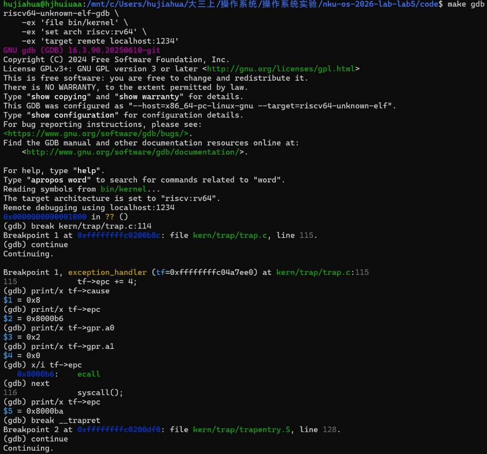

`__trapret` 的地址是 `0xffffffffc0200df0`。反汇编末尾的 `sret` 在 `0xffffffffc0200e50`。

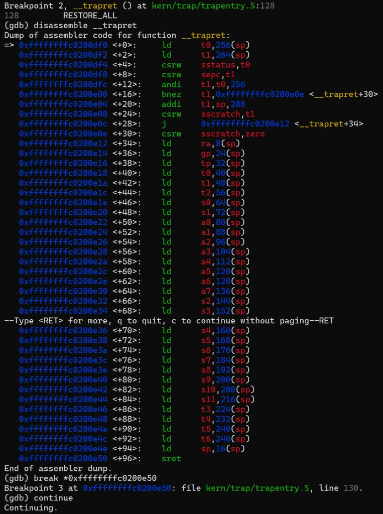

在 `sret` 上停下时：

```text
$sepc    = 0x8000ba
$sstatus = 0x80000000000046020
$a0      = 0x3
$pc      = 0xffffffffc0200e50    # sret
```

`$sepc` 等于刚才加 4 之后的 `epc`，因此返回后不会再次执行同一条 `ecall`。`$a0` 已从系统调用号 `2` 变成 `fork` 的返回值 `3`，这是父进程得到的子进程 pid。`$sstatus` 的 `SPP` 位为 0，`sret` 按该位回到用户态。单步执行 `sret` 之后，`$pc` 变为 `0x8000ba`，下一条指令是 `sw a0, 12(sp)`，即用户库把返回值写回局部变量。

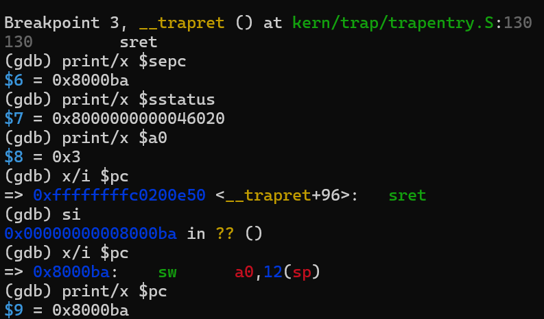

宿主 GDB 附加到 `qemu-system-riscv64` 后，在 `helper_sret` 设断点并继续。客户机再次停在 `sret` 并执行 `si` 时，QEMU 的线程 3 命中该断点。左边的 `si` 会暂时没有新提示符，因为宿主断点把 QEMU 停住了。

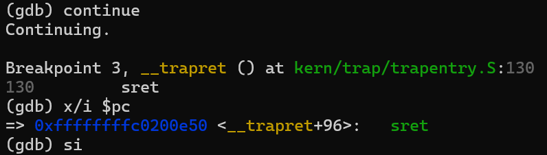

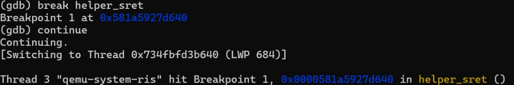

此时 `bt` 为：

```text
#0  helper_sret
#1  code_gen_buffer
#3  cpu_exec
#6  start_thread
```

`cpu_exec` 是 QEMU 执行客户机指令的循环，`code_gen_buffer` 是 TCG 生成的宿主机代码，`helper_sret` 由这段代码调用。发行版 QEMU 没有 `helper_sret` 的参数调试信息，`print env->sepc` 报告 `No symbol "env" in current context`。`sepc` 和 `sstatus` 以客户机 GDB 中已经读到的值为准。看完调用栈后删除该断点并 `continue`，客户机侧的 `si` 随之结束。

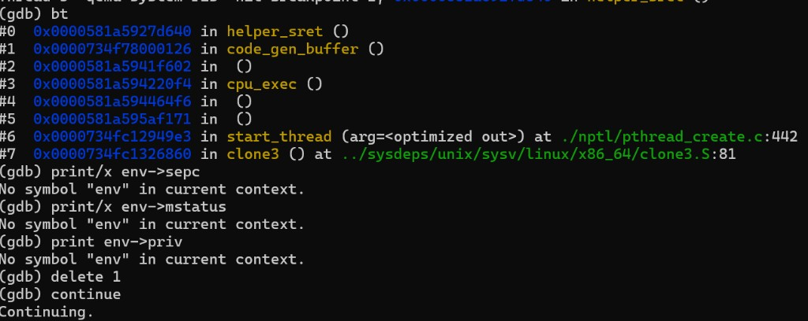
